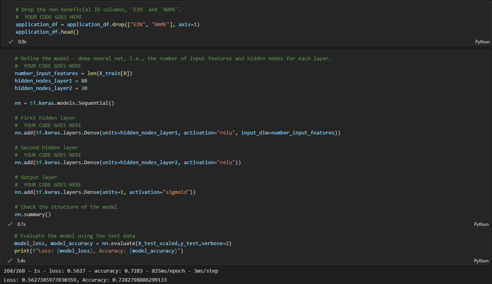
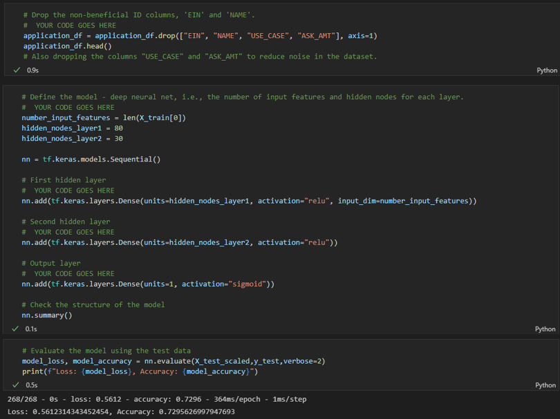
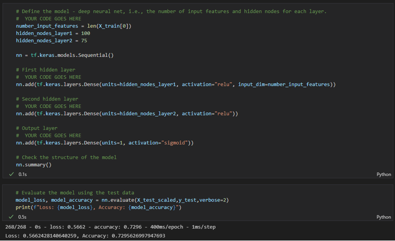
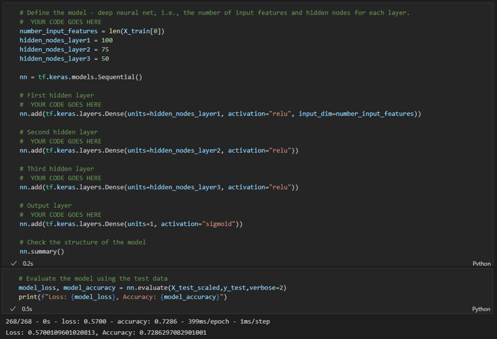
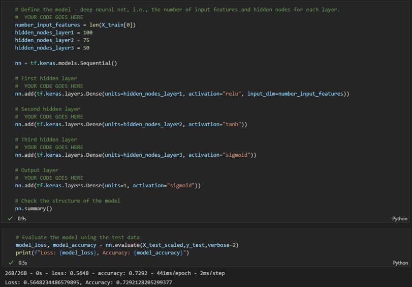
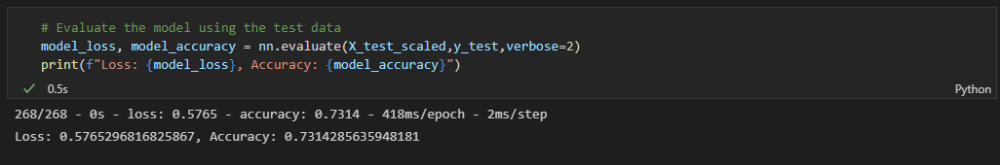

# **Neural Network Charity Analysis**

## **Overview of Analysis**
Given a dataset on charity contributions we were to apply our knowledge of Machine Learning and Neural Networks in producing a binary classifier that can prdict the success of an applicant if funded by Alphabet Soup, a fundraising company.

**Resources:**
- Dataset - a comma separated values file was provided that included past performance data for several fundraisers hosted by Alphabet Soup.
- Software - Microsoft Excel and Python were used to inspect, import, and analyse the data. Dependancies such as Pandas, tensorflow, sklearn.model_selction (train_test_split), sklearn.preprocessing (StandardScaler, OneHotEncoder) were imported to support the Jupyter Noteboom functions within the analysis.

## **Results**

### - **_Data Processing_**
All the processing was accomplished within jupyter notebook. Two data columns, APPLICATION_TYPE and CLASSIFICATION were identified to be binned due to having too many unique values.
- The column *IS_SUCCESSFUL* was identified as the target variable.
- Two columns with headings *EIN* and *NAME* were deemed non-beneficial and was dropped form the dataset.
- All other remining columns were considered to be features (inputs) for the analysis.

### - **_Compiling, Training, and Evaluating the Model
After splitting the data into their training and testing sets, sklearn.processing StandarScaler was used to fit and scale the data.
- Tensorflow Karas Sequential model was used as the Neural Network Model. Initial model was built with two hidden layers with 80 and 30 neurons in cluded in layer1 and layer2 respectively. Both layers were set to activate with the Rectified Linear Unit (**ReLu**) activation function. ReLu activation was used because of the positive nonlinear nature of the input data.
- The desired target model performance was 75%. With the setting that were chose, the target performance was not achieved. The performance for the current settings was only 72.83%.

- Five attempts were made to improve the performance of the model by varying the parameters and the input values. The results are listed below.
  - ***Attempt1:*** The first attempt at improving the performance was to drop two additional columns from the data set. The two columns *USE_CASE* and *ASK_AMT* were selected to dropped from the features list because of the higher level of variability with outliers that skew the input data. With the two columns dropped (with no other changes). The performance was recorded at 72.96%, a slight increase but not by much.

  

  - ***Attempt2:*** In the second attempt the number of neurons were increase in both hidden layers. In layer1 the number of neurons were increase form 80 to a 100 and in layer2 form 30 to 75. The other factors were unchanged. The performance came in at 72.96%, no change from Attempt1.

  

  - ***Attempt3:*** For attempt3 Added a third layer with 50 neurons with ReLu activation function. The performance for Attempt3 came in at 72.86%, still much less than the 75% target.

  

  - ***Attempt4:*** The fourth attempt was performed by changing the activation functions of the three layers. Layer2 and Layer3 activation functions were changed from the ReLU to _tanh_ and _sigmoid_ respectively. The performance for this attempt was logged at 72.92%, again not much of an improvement in reaching 75% target performance.

  

  - ***Attempt5:*** This was the last attempt at improving the performance fo the model. For this attempt two more layers were added for a total of five layers. The number of neurons for each layer was adjusted to 80 and the activation function was set to ReLu for all layers. The performance in this attempt was 73.14%.

  

## Summary
The model chosen to predict the outcome of the fundraisers failed to reach the desired 75% performance target. The attempts to improve the performence did not yield the desired target either. The highet performance value reached was a 73.14% which still was much less than that of the desired 75%.
Many reasons can be contributing to the non improving performance. It could be that there are other features that are of high variance and skew that is impeding the models' behavior in reaching the target. In this case further study is necessary to identify the data columns. Removing the identified columns form the input dataset will provide a better model in turn returning a higher performance value. Another reason could be that the model considered for the analysis is not ideal for the data set at hand. In this case we can consider other models such as Random Forest Classifier Model which can easily handle outliers and nonlinear data.